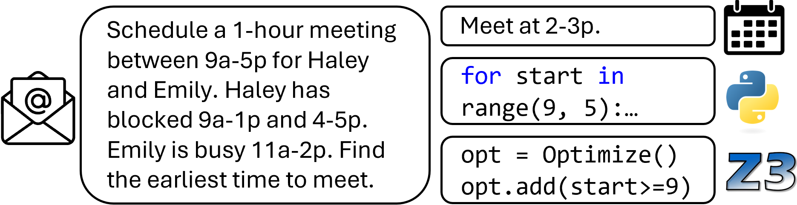

# Constraint Satisfaction Planning with LLM Coding and Inference-Time Scaling



## Overview

This repository contains the implementation and evaluation framework for our research on constraint satisfaction planning using Large Language Models (LLMs). We systematically evaluate both closed- and open-source models across three output modalities: direct plan generation, Python code generation, and Z3 SMT solver code generation.

Real-life textual planning tasks such as meeting scheduling pose significant challenges to LLMs, especially when complexity is high. While previous work primarily studied auto-regressive generation of plans with closed-source models, we demonstrate the strength of both closed- and open-source models in generating executable programs that output plans. We consider not only standard Python code, but also code for constraint satisfaction problem solvers that conform to syntactically scaffolded planning tasks. Our results show that the latest reasoning models perform significantly better when generating both plans and programs.

### Evaluation Tasks

We evaluate on the [Natural Plan](https://github.com/google-deepmind/natural-plan) benchmark with three tasks:
- **Calendar Scheduling**: Finding meeting times that satisfy availability constraints
- **Trip Planning**: Creating itineraries that satisfy travel and stay duration constraints  
- **Meeting Planning**: Scheduling multiple meetings with location and time constraints

Additionally, we evaluate on the **ZebraLogic** dataset for logical reasoning tasks.

## Project Structure

```
.
├── data/                    # Task datasets (100 examples per task)
│   ├── calendar_scheduling_100.json
│   ├── calendar_scheduling_100_constraints.json
│   ├── trip_planning_100.json
│   ├── trip_planning_100_constraints.json
│   ├── meeting_planning_100.json
│   ├── meeting_planning_100_constraints.json
│   └── zebralogic_sample_100.json
├── source/                  # Main implementation scripts
│   ├── iterative_plan_refinement_feedback_zebra.py
│   ├── iterative_python_refinement_noconstraintfeedback_zebra.py
│   ├── iterative_smt_refinement_feedback_enhanced_zebra.py
│   └── helpers/             # Utility scripts
│       ├── evaluate_by_constraint.py
│       ├── execute_smt.py
│       └── convert_smt_output_format.py
└── output/                  # Generated results
    ├── Plan/                # Direct plan generation results
    ├── Python/              # Python code generation results
    └── SMT/                 # Z3 SMT solver results
```

## Requirements

- Python 3.8+
- Required packages: `kani`, `openai`, `z3-solver`, `tiktoken`
- API keys for OpenAI and DeepSeek (configured in `keys/` directory)

## Data

The datasets consist of 100 examples per task, stored in JSON format in the `data/` directory. Each task has:
- Task examples: `{task}_100.json`
- Constraint definitions: `{task}_100_constraints.json`

The datasets were created via `source/helpers/downsample_data.py` from the original Natural Plan benchmark.

## Usage

The framework supports three approaches for solving planning tasks:

### 1. Direct Plan Generation

Generate plans directly using LLMs with iterative refinement and constraint feedback.

**Generate plans:**
```bash
cd source
python iterative_plan_refinement_feedback_zebra.py --task {calendar|trip|meeting|zebralogic} --model {MODEL}
```

**Evaluate plans:**
```bash
python helpers/evaluate_by_constraint.py --task {TASK} --model {MODEL} --output plan
```

**Supported models:** `DeepSeek-R1`, `DeepSeek-V3`, `gpt-4o-mini`, `gpt-5-2025-08-07`, `o3-mini`, and others.

**Additional options:**
- `--max_passes`: Maximum refinement passes (default: 5)
- `--max_concurrent`: Parallel processing workers (default: 10)
- `--start` / `--end`: Process example range
- `--examples`: Comma-separated list of specific examples
- `--fresh`: Clear existing output before running

**Output location:** `output/Plan/{MODEL}/{TASK}/n_pass/{example_id}/{pass_number}_pass/`

---

### 2. Python Code Generation

Generate Python programs that solve the planning task, with iterative refinement.

**Generate Python code:**
```bash
cd source
python iterative_python_refinement_noconstraintfeedback_zebra.py --task {TASK} --model {MODEL}
```

**Evaluate Python-generated plans:**
```bash
python helpers/evaluate_by_constraint.py --task {TASK} --model {MODEL} --output python
```

**Output location:** `output/Python/{MODEL}/{TASK}/n_pass/{example_id}/{pass_number}_pass/`

---

### 3. Z3 SMT Solver Code Generation

Generate Z3 SMT solver code with iterative refinement and constraint feedback.

**Step 1: Generate Z3 code**
```bash
cd source
python iterative_smt_refinement_feedback_enhanced_zebra.py --task {TASK} --model {MODEL}
```

**Step 2: Execute generated code**
```bash
python helpers/execute_smt.py --task {TASK} --model {MODEL}
# Note: --model can accept multiple models: --model MODEL1 MODEL2
```

**Step 3: Convert output format**
```bash
python helpers/convert_smt_output_format.py --task {TASK} --model {MODEL}
# Note: --model can accept multiple models: --model MODEL1 MODEL2
```

**Step 4: Evaluate against constraints**
```bash
python helpers/evaluate_by_constraint.py --task {TASK} --model {MODEL} --output z3
```

**Output location:** `output/SMT/{MODEL}/{TASK}/n_pass/{example_id}/{pass_number}_pass/`

---

## Evaluation

The evaluation framework checks solutions against domain-specific constraints:

- **Calendar Scheduling**: Meeting duration, disallowed time ranges, day constraints
- **Trip Planning**: Trip length, city stay durations, flight constraints, coverage
- **Meeting Planning**: Meeting durations, location constraints, time overlaps, person availability

Each evaluation produces:
- `evaluation.json`: Detailed constraint satisfaction results
- `report.json`: Summary report with accuracy metrics

Evaluation results include:
- `constraints_satisfied`: Boolean indicating if all constraints are met
- `violated_constraints`: List of unsatisfied constraints
- `is_exact_match`: Whether prediction matches gold standard
- `status`: "Correct", "Error", or "Wrong plan"

## Results Structure

Results are organized hierarchically:

```
output/
├── {Approach}/              # Plan, Python, or SMT
│   └── {Model}/             # e.g., DeepSeek-R1
│       └── {Task}/          # calendar, trip, meeting, zebralogic
│           └── n_pass/
│               └── {example_id}/
│                   ├── 1_pass/
│                   │   ├── conversation.json    # Full conversation history
│                   │   ├── solution.py          # Generated code (for Python/SMT)
│                   │   ├── plan.json            # Generated plan (for Plan)
│                   │   ├── output.out           # Execution output
│                   │   ├── evaluation.json      # Constraint evaluation
│                   │   └── reasoning.txt        # Reasoning tokens (if available)
│                   ├── 2_pass/
│                   └── ...
│       └── task_analysis_results_{Approach}_{Model}.xlsx
```

## Iterative Refinement Process

All three approaches use iterative refinement with up to 5 passes:

1. **Initial Generation**: LLM generates plan/code based on task description
2. **Execution**: Code is executed (for Python/SMT) or plan is extracted (for Plan)
3. **Evaluation**: Solution is evaluated against constraints
4. **Feedback**: If constraints are violated or errors occur, feedback is provided
5. **Refinement**: LLM generates improved solution based on feedback
6. **Termination**: Process stops when solution is correct or max passes reached

Feedback includes:
- Execution errors with error messages
- Constraint violations with specific violated constraints
- Previous solution output for reference

## Citation

If you use this code in your research, please cite our paper: N/A

<!-- ```bibtex
@article{your-paper,
  title={Constraint Satisfaction Planning with LLM Coding and Inference-Time Scaling},
  author={Your Authors},
  journal={Your Venue},
  year={2025}
}
``` -->

## License

See [LICENSE](LICENSE) file for details.
