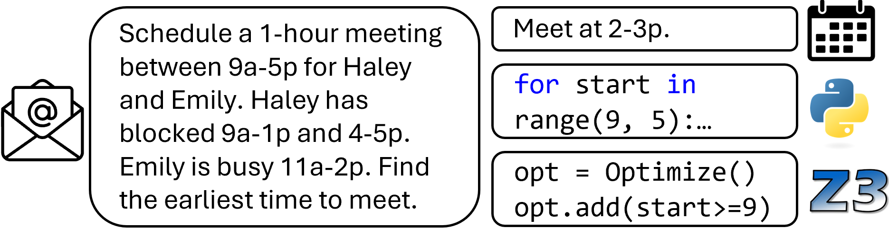

# Constraint Satisfaction Planning with LLM Coding and Inference-Time Scaling

## Overview

Real-life textual planning tasks such as meeting scheduling have posed much challenge to LLMs especially when the complexity is high. While previous work primarily studied auto-regressive generation of plans with closed-source models, we systematically survey and show the strength of both closed- and open-source models in generating programs, which are executed to output the plan. We consider not only standard Python code, but also the code to a constraint satisfaction problem solver that conforms to syntactically scaffolding of a family of planning tasks. Further, we show the latest reasoning models performs significantly better when generating both plans and programs. Finally, we provide a detailed analysis on the programs and reasoning tokens to understand models' failure.



We evaluate on the [Natural Plan](https://github.com/google-deepmind/natural-plan) benchmark on three tasks: calendar scheduling, trip planning, and meeting planning. We use LLMs with three types of output: plans, Python code, and [Z3](https://github.com/Z3Prover/z3) code. 

## Data

The downsampled 100-example-per-task datasets are in [data/](data/)`*_100.json` created via [source/downsample_data.py](source/downsample_data.py).

## Evaluation

### Plan
For plan generation on HuggingFace models, go to [source/](source/) and run
> python force_json_[TASK]_text.py --model MODEL

where `TASK` is one of *calendar*, *trip*, *meeting* tasks; `MODEL` is a model name supported HuggingFace

For plan generation on OpenAI models, go to [source/](source/) and run
> python openai_force_json_[TASK]_text.py --model MODEL

where `TASK` is one of *calendar*, *trip*, *meeting* tasks; `MODEL` is a model name supported OpenAI API

For plan generation with reasoning on DeepSeek models, go to [source/](source/) and run
> python deepseek_opai_[TASK]_text_reason.py --model MODEL

where `TASK` is one of *calendar*, *trip*, *meeting* tasks; `MODEL` is a model name supported DeepSeek API

Now evaluate the output plan with
> python evaluate_by_constraint.py --task TASK --model MODEL --output OUTPUT

where `TASK` is one of *calendar*, *trip*, *meeting*, or all.; `MODEL` is a model name supported HuggingFace, OpenAI API, or DeepSeek API; `OUTPUT` is either *plan* or *python*

This creates corresponding files and a readable report in [output/Plan/](output/Plan/)`MODEL/TASK/report.json`. 

### Python
For Python code generation, go to [source/](source/) and run
> python [TASK]_plan_code_gen.py --model MODEL

where `TASK` is one of *calendar*, *trip*, *meeting* tasks; `MODEL` is a model name supported HuggingFace

For Python code generation on OpenAI models, go to [source/](source/) and run
> python openai_[TASK]_plan_code_gen.py --model MODEL

where `TASK` is one of *calendar*, *trip*, *meeting* tasks; `MODEL` is a model name supported OpenAI API

For Python code generation with reasoning on DeepSeek models, go to [source/](source/) and run
> python deepseek_opai_[TASK]_code_reason.py --model MODEL

where `TASK` is one of *calendar*, *trip*, *meeting* tasks; `MODEL` is a model name supported DeepSeek API

Now evaluate the output plan from the Python generated outputs with
> python evaluate_by_constraint.py --task TASK --model MODEL --output OUTPUT

where `TASK` is one of *calendar*, *trip*, *meeting*, or all.; `MODEL` is a model name supported HuggingFace, OpenAI API, or DeepSeek API; `OUTPUT` is either *plan* or *python*

This creates corresponding files and a readable report in [output/Python/](output/Python/)`MODEL/TASK/report.json`. 

### Z3 
For Z3 code generation, go to [source/](source/) and run
> python generate_smt_input.py --model MODEL --data DATA

where `MODEL` is a model name supported HuggingFace, OpenAI API, or DeepSeek API; `DATA` is one of *calendar*, *trip*, *meeting*, or all. 

Execute the generated code:
> python execute_smt.py --model MODEL --data DATA

Convert the output into a unified format:
> python convert_smt_output_format.py --model MODEL --data DATA

Evaluate against constraints:
> python evaluate_by_constraint.py --output z3 --model MODEL --data DATA

This creates corresponding files and a readable report in [output/SMT/](output/SMT/)`MODEL/TASK/report.json`. 

# Iterative SMT Refinement Pipeline

This document describes the pipeline implemented in `iterative_smt_refinement_parallel.py` for solving scheduling tasks using iterative refinement with SMT solvers.

## Pipeline Overview

The pipeline processes scheduling tasks (calendar, trip, and meeting) through multiple passes, where each pass attempts to solve the task using a language model to generate Z3 solver code. The process continues until a valid solution is found or the maximum number of passes is reached.

## Pipeline Steps

### 1. Task Loading and Initialization
**Input:**
- Task type: "calendar", "trip", or "meeting"
- Model name (e.g., "DeepSeek-R1")
- Maximum number of passes (default: 5)
- Number of parallel workers (default: 10)
- Rate limit (default: 60 requests per minute)

**Output:**
- Loaded task examples from JSON files in `data/` directory
- Initialized task-specific constraints and evaluation functions

### 2. Parallel Processing Setup
**Input:**
- List of task examples
- Number of workers
- Rate limiting parameters (if using OpenAI API)

**Output:**
- Configured semaphore for parallel execution
- Rate limiter for API calls (if applicable)
- Worker pool for parallel processing

### 3. Example Processing (per example)
For each example, the following steps are executed:

#### 3.1. Prompt Construction
**Input:**
- Task description from example
- Task type-specific instructions
- Expected output format

**Output:**
- Formatted prompt for the language model
- Example prompts for different tasks:
  ```
  # Calendar Task Prompt
  Given the following scheduling problem:
  [Task description from example]
  
  Your solution should always have three things: the day to meet, the start time, and the end time.
  Your output should be a string that starts with 'SOLUTION:' followed by three lines in this exact format:
  Day: <day>
  Start Time: <HH:MM> (24-hour format)
  End Time: <HH:MM> (24-hour format)
  
  Write a Python program that solves it using the Z3 solver. Always surround your final code with ```python\nYOUR_CODE\n```.

  # Trip Task Prompt
  Given the following scheduling problem:
  [Task description from example]
  
  Note that if one flies from city A to city B on day X, then they are in both cities A and B on day X, which contributes to the total number of days in each city.
  Write a Python program that solves it using the Z3 solver. Always surround your final code with ```python\nYOUR_CODE\n```.
  ```

#### 3.2. Model Inference
**Input:**
- Constructed prompt
- Model parameters (temperature, max tokens, etc.)

**Model Used:**
- Primary LLM (specified by --model argument):
  - GPT models (e.g., gpt-4o-mini)
  - DeepSeek models (e.g., DeepSeek-R1, DeepSeek-V3)
  - Other HuggingFace models

**Output:**
- Model response containing:
  - Natural language explanation
  - Python code using Z3 solver
  - Solution in specified format

#### 3.3. Code Extraction and Storage
**Input:**
- Model response text

**Process:**
- Uses regex pattern matching to extract code between ```python and ``` markers
- No LLM involved in this step

**Output:**
- Extracted Python code from the response
- Saved files:
  - `conversation.json`: Full conversation history including prompt and response
  - `solution.py`: Extracted and cleaned Python code

#### 3.4. Code Execution
**Input:**
- Generated Python code
- Task-specific constraints

**Process:**
- Direct Python execution of the generated code
- No LLM involved in this step

**Output:**
- Execution result containing:
  - `has_execution_error`: Boolean indicating if execution failed
  - `execution_output`: Output from code execution (including any error messages)
  - Saved file: `output.out` containing the complete execution output

#### 3.5. Solution Evaluation
**Input:**
- Execution output
- Task-specific constraints
- Gold standard solution

**Model Used:**
- GPT-4.1-nano for answer extraction with task-specific prompts:
  ```
  # Calendar Task Extraction Prompt
  Given the following time range:
  [Execution output]
  Extract the meeting start day and time in a JSON like {"day": "Monday", "start_time": "14:30", "end_time": "15:30"}. The time should be in 24-hour format. If no time range is given at all, output an empty JSON.

  # Trip Task Extraction Prompt
  Given the following itinerary:
  [Execution output]
  Extract the days spent in each city in a JSON format like {"itinerary": [{"day_range": "Day 1-2", "place": "Reykjavik"}, {"day_range": "Day 2-4", "place": "Stockholm"}......]}. Only keep the days in a city. If flying from city A to city B, that day should be included in both ranges for both cites. The day range should be inclusive. For example, arrving at Reykjavik in Day 1 and flying to Stockholm on Day 2 will result in the dictionary above. If no itinerary is given, output an empty JSON.

  # Meeting Task Extraction Prompt
  Given the following meeting schedule:
  [Execution output]
  Extract the time and the person of each meeting in a JSON format like {"itinerary": [{"action": "meet", "person": "David","start_time": "13:00", "end_time": "14:00"}, ...]}. Do not include location. Only keep the meeting times, and ignore time for starting, waiting, or traveling. The time should be converted to a 24-hour format. If no time range is given at all, output an empty JSON.
  ```

**Output:**
- Evaluation result containing:
  - `pred`: Extracted prediction in JSON format
  - `gold`: Gold standard solution in JSON format
  - `is_exact_match`: Boolean indicating if prediction matches gold standard
  - `constraints_satisfied`: Boolean indicating if all constraints are met
  - `violated_constraints`: List of constraints that were not satisfied
  - `status`: "Correct", "Error", or "Wrong plan"
  - Saved file: `evaluation.json` containing all evaluation results

#### 3.6. Feedback Generation and Iteration
**Input:**
- Evaluation results
- Execution output
- Violated constraints

**Process:**
- No LLM involved in this step
- Feedback is generated based on evaluation results

**Output:**
- New prompt for next iteration containing:
  - For execution errors:
    ```
    The previous code had the following error:
    [Error message]
    
    Please fix the code and provide a corrected version.
    ```
  - For constraint violations:
    ```
    The previous solution produced this output:
    [Execution output]
    
    [Constraint violation feedback]
    
    Please revise your solution to satisfy these constraints.
    ```

#### 3.7. Iteration Control
The process continues until one of these conditions is met:
- A correct solution is found (all constraints satisfied)
- Maximum number of passes is reached (default: 5)
- An unrecoverable error occurs

Each pass's results are saved in a separate directory:
```
{pass_number}_pass/
├── conversation.json    # Full conversation history
├── solution.py         # Generated Z3 code
├── output.out          # Code execution output (including any error messages)
└── evaluation.json     # Evaluation results
```

### 4. Results Collection
**Input:**
- Results from all examples and passes

**Output:**
- Directory structure:
  ```
  output/
  ├── {approach}/  # SMT, Python, or Plan
  │   └── {model_name}/
  │       ├── {task_type}/
  │       │   └── n_pass/
  │       │       └── {example_name}/
  │       │           ├── 1_pass/
  │       │           │   ├── solution.py  
  │       │           │   ├── output.out 
  │       │           │   ├── evaluation.json
  │       │           │   └── conversation.json 
  │       │           ├── 2_pass/
  │       │           └── ...
  │       └── task_analysis_results_{approach}_{model_name}.xlsx
  ```

### 5. Analysis and Reporting
**Input:**
- Collected results from all examples

**Output:**
- Excel file containing:
  - Summary sheet: Number of passes per example
  - Detailed sheet: Per-pass results including:
    - Execution errors
    - Solution status
    - Constraint satisfaction
    - Exact matches with gold standard

## Key Files and Directories

- `source/iterative_smt_refinement_parallel.py`: Main pipeline implementation
- `source/analyze_results.py`: Results analysis and Excel report generation
- `data/`: Input task examples
- `output/`: Generated solutions and analysis results

## Running the Pipeline

The script supports various command-line arguments to customize the execution:

### Basic Usage
```bash
# Run calendar task with default settings
python source/iterative_smt_refinement_parallel.py --task calendar --model DeepSeek-R1

# Run trip task with specific model
python source/iterative_smt_refinement_parallel.py --task trip --model DeepSeek-V3

# Run meeting task with custom number of passes
python source/iterative_smt_refinement_parallel.py --task meeting --model DeepSeek-R1 --max_passes 3
```

### Advanced Usage
```bash
# Process specific examples only
python source/iterative_smt_refinement_parallel.py --task calendar --model DeepSeek-R1 --examples "25,35,42"

# Run with custom parallel processing settings
python source/iterative_smt_refinement_parallel.py --task calendar --model DeepSeek-R1 --max_concurrent 5 --rate_limit 30

# Process a range of examples
python source/iterative_smt_refinement_parallel.py --task calendar --model DeepSeek-R1 --start 10 --end 20

# Force fresh run (clear existing output)
python source/iterative_smt_refinement_parallel.py --task calendar --model DeepSeek-R1 --fresh
```

### Command Line Arguments
- `--task`: Task type to run ("calendar", "trip", or "meeting")
- `--model`: Model to use (e.g., "DeepSeek-R1", "DeepSeek-V3")
- `--max_passes`: Maximum number of refinement passes (default: 5)
- `--max_concurrent`: Maximum number of concurrent examples to process (default: 10)
- `--rate_limit`: Rate limit in requests per minute (default: 60)
- `--start`: Start example number (inclusive)
- `--end`: End example number (inclusive)
- `--fresh`: Clear all output directories before running
- `--examples`: Comma-separated list of example numbers to run (e.g., "25,35")

### Analyzing Results
After running the pipeline, analyze the results using:
```bash
# Analyze results for a specific model
python source/analyze_results.py --model_path output/SMT/DeepSeek-R1

# Analyze results for a different approach
python source/analyze_results.py --model_path output/Python/DeepSeek-R1
```

## Notes

- The pipeline uses parallel processing to handle multiple examples simultaneously (default: 10 concurrent examples)
- Rate limiting is implemented for API-based models (default: 60 requests per minute)
- Each pass's results are saved for analysis and debugging
- The pipeline supports three types of scheduling tasks with specific constraints and evaluation criteria
- Results are organized by approach (SMT, Python, Plan), model, and task type
